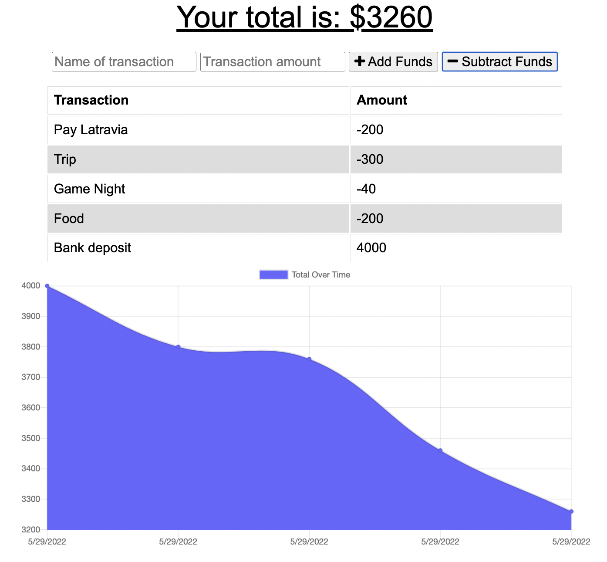

# moneybag-PWA-budgetTracker 

_by Latravia Gordon_ 

## Description

> Giving users a fast and easy way to track their money is important, but allowing them to access that information at any time is even more important. Having offline functionality is paramount to the success of an application that handles users’ financial information.

> Update an existing budget tracker application to allow for offline access and functionality. The user will be able to add expenses and deposits to their budget with or without a connection. If the user enters transactions offline, the total should be updated when they're brought back online.

## Table of Contents

- [Requirements](#requirements)
- [Installation](#installation)
  <!-- - [Usage](#usage) -->
    <!-- - [Walkthrough](#walkthrough) -->
- [Screenshot](#screenshot)
- [Tests](#tests)
- [Questions](#questions)
- [License](#license)

# Requirements

<!--  -->

> User Story:  
> AS AN avid traveler
> I WANT to be able to track my withdrawals and deposits with or without a data/internet connection
> SO THAT my account balance is accurate when I am traveling  

---

> Acceptance Criteria:  
> GIVEN a budget tracker without an internet connection
> WHEN the user inputs an expense or deposit
> THEN they will receive a notification that they have added an expense or deposit
> WHEN the user reestablishes an internet connection
> THEN the deposits or expenses added while they were offline are added to their transaction history and their totals are updated.

## Installation

- To install run `npm install` or `npm i` then install the dependencies:
- `express`
- `mongoose`
- `morgan`
- `compression`

<!-- # Usage

 -->

<!-- # Walkthrough

Walkthrough video can be found via [YouTube](https://youtu.be/lRZn0WGreTA). -->

# Screenshot

<!--  -->

<!-- 
 -->

## Tests

- To test my app locally, type `npm start` into your terminal.  
  Then type `http://localhost:(PORT)` EXAMPLE: (`http://localhost:3001`)

## Questions

For any questions about the project, please contact me by either of the following links:

- Email = gordonlc18@gmail.com
  or visit my GitHub profile:
- GitHub - [gordonlc18](https://github.com/gordonlc18)

## License

This project is licensed under the MIT license.
